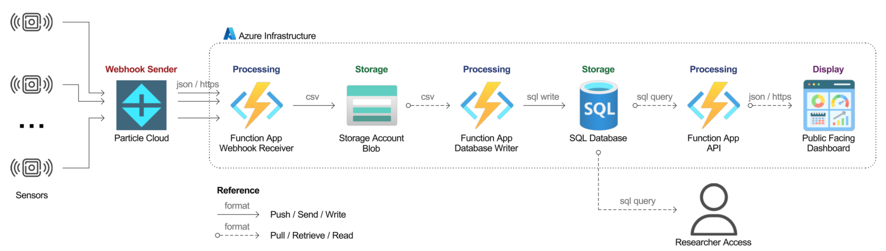

# BARI Environmental Sensor Network - Project Overview

## What This System Does

The BARI Environmental Sensor Network monitors environmental conditions in Boston's Blue Hill Avenue corridor through 55 Particle.io sensors deployed in partnership with community organizations as part of the Common SENSES Project. Every 15 minutes, these sensors collect temperature, humidity, and noise data, which flows through an automated Azure-based pipeline to provide both research-grade historical data and real-time public accessibility through an interactive dashboard.

**Quick Facts:**
- 55 active sensors in the Common SENSES project area (Blue Hill Avenue corridor)
- ~290,000 readings collected per day
- 15-minute collection intervals
- Data stored in UTC, displayed in US/Eastern timezone
- <$70/month operational cost
- Public dashboard + research database

## System Architecture

### Data Flow

**1. Data Collection → 2. Ingestion → 3. Storage → 4. Processing → 5. Database → 6. Visualization**

1. **Sensors (Particle.io devices)** measure temperature, humidity, and noise every {{ sensors.collection_interval }}
2. **Particle Cloud** receives sensor readings and triggers webhooks
3. **Webhook Function** (Azure) receives JSON payloads and writes raw data to Blob Storage
4. **Blob Storage** archives data and triggers the processor function
5. **Blob Processor Function** deduplicates, validates, and writes cleaned data to SQL Database
6. **SQL Database** stores validated readings with full audit trail
7. **API Function** serves data requests from the dashboard
8. **Public Dashboard** (Static Web App) displays interactive time-series visualizations

**Data Transfer Types:**
- Solid arrows (→) = Push/Write operations (HTTPS POST, writes)
- Dashed arrows (⇢) = Pull/Trigger operations (blob triggers, SQL queries, API calls)

## Key Components

### Azure Infrastructure

**Function Apps (4 functions):**
- **Webhook Receiver**: Accepts Particle Cloud webhooks, archives raw JSON to blob storage
- **Blob Processor**: Reads from blob storage, performs multi-layer deduplication, writes to SQL
- **API Function**: Serves sensor data requests to the public dashboard
- **Daily Reporter**: Automated email summaries of sensor performance (monitoring/operations)

**SQL Database:**
- Tables: `sensor_readings`, `sensor_errors`, `sensor_startup_events`, `sensor_installs`
- Composite indexes on `(device_id, published_at)` for query performance
- Computed columns for data quality metrics
- Private endpoint access only (secure)

**Blob Storage:**
- Organized folders: `incoming/`, `archived/`, `failed-writing/`, `duplicated/`, `overlapping/`
- Raw JSON preservation for audit trail
- Blob-triggered processing pipeline

**Static Web App:**
- Vanilla HTML/CSS/JavaScript (no frameworks for easier handoff)
- Plotly.js for interactive time-series charts
- Flatpickr for date range selection
- Caching headers to minimize API calls and data egress costs

**Networking:**
- VNet with private endpoints for SQL and Blob Storage
- Public ingress: webhook endpoint, Static Web App
- All internal traffic secured through private network

### Particle.io Platform

- {{ sensors.active_count }} devices configured with webhook integration
- Real-time data transmission to Azure
- Device health monitoring and alerts
- Webhook retry logic for reliability

## Data Quality & Reliability

The system implements multiple layers of protection:

**Deduplication (3 levels):**
1. Webhook level: Reject exact duplicates within 5-second window
2. Batch level: Remove duplicates within blob file
3. Database level: Composite unique constraint on `(device_id, published_at)`

**Error Handling:**
- Failed webhook writes → `failed-writing/` folder for manual review
- Duplicate detections → `duplicated/` folder with metadata
- Overlapping time ranges → `overlapping/` folder
- All errors logged to `sensor_errors` table

**Monitoring:**
- Daily automated reports via email
- Missing data analysis by sensor
- Application Insights for function performance
- Cost tracking and alerts (warning at ${{ costs.alert_warning }}, critical at ${{ costs.alert_critical }})

## Cost Management

Monthly operational costs kept under ${{ costs.monthly_target }} through:
- Efficient SQL query patterns with proper indexing
- API response caching (24-hour headers)
- Reduced Application Insights logging verbosity
- Serverless Function App consumption plan (Flex Consumption tier)
- Basic tier SQL Database with appropriate sizing

**Cost Monitoring:**
- Cost alerts configured at ${{ costs.alert_warning }} (warning) and ${{ costs.alert_critical }} (critical)
- Monthly reviews via Azure Cost Management dashboard
- See [Cost Tracking](03-operating-the-system/cost-tracking.md) for detailed tracking procedures

## Public Dashboard

**Available at:** {{ urls.dashboard_public }}

**Features:**
- Interactive time-series charts for temperature, humidity, noise
- Flexible date range selection
- Per-sensor data visualization
- Real-time data updates ({{ sensors.collection_interval }} granularity)
- Mobile-responsive design
- No authentication required (public data for community transparency)

## Key Design Principles

**Maintainability First:**
- Vanilla JavaScript over frameworks (easier handoff)
- Clear code organization and commenting
- Comprehensive documentation
- Modular architecture

**Data Integrity:**
- Multiple deduplication layers
- Complete audit trail via blob storage
- Defensive programming with input validation
- Graceful error handling

**Cost Efficiency:**
- Strategic caching to minimize API calls and data egress
- Efficient database indexing
- Serverless architecture
- Careful monitoring of Azure costs

**Defensive Programming:**
- Input validation at every stage
- Connection cleanup and timeout handling
- Comprehensive error logging
- Retry logic where appropriate

## Who Should Use This Documentation

**System Administrators:** Start with [Daily Checklist](03-operating-the-system/daily-checklist.md) for daily tasks and [Troubleshooting](03-operating-the-system/troubleshooting/sensor-not-reporting.md)

**Developers/Future Maintainers:** Read [Architecture](01-understanding-the-system/architecture.md) and [Function Code Reference](05-reference/function-code-reference.md) to understand implementation

**Researchers:** See [Quick Start](02-working-with-data/quick-start.md) for getting data immediately and [Common Queries](02-working-with-data/common-queries.md) for typical analysis tasks

**IT Support:** Check [Step-by-Step Guides](06-appendices/step-by-step-guides/create-sql-database.md) for Azure Portal management tasks

## Navigation Guide

**Understanding the System:**
- [What It Does](01-understanding-the-system/what-it-does.md) - Project background, Common SENSES context, stakeholders
- [Architecture](01-understanding-the-system/architecture.md) - Detailed architecture with network topology
- [Data Flow](01-understanding-the-system/data-flow.md) - How data moves through the pipeline
- [Design Decisions](01-understanding-the-system/design-decisions.md) - Why we built it this way

**Working with Data:**
- [Quick Start](02-working-with-data/quick-start.md) - Get data right now
- [Connecting to Database](02-working-with-data/connecting-to-database.md) - Connection strings and authentication
- [Common Queries](02-working-with-data/common-queries.md) - Copy-paste SQL for typical tasks
- [Understanding the Schema](02-working-with-data/understanding-the-schema.md) - Table relationships and columns

**Operating the System:**
- [Daily Checklist](03-operating-the-system/daily-checklist.md) - What to check every day
- [Monitoring Health](03-operating-the-system/monitoring-health.md) - System health indicators
- [Cost Tracking](03-operating-the-system/cost-tracking.md) - Where costs come from
- [Troubleshooting](03-operating-the-system/troubleshooting/sensor-not-reporting.md) - Common issues and fixes

**Making Changes:**
- [Deploying Code Updates](04-making-changes/deploying-code-updates.md) - Push function changes
- [Database Changes](04-making-changes/database-changes.md) - Schema migrations
- [Sensor Configuration](04-making-changes/sensor-configuration.md) - Particle.io webhook settings

**Technical Reference:**
- [Azure Infrastructure](05-reference/azure-infrastructure/function-apps.md) - Complete Azure resource details
- [Complete Schema](05-reference/complete-schema.md) - Every table, column, index
- [Function Code Reference](05-reference/function-code-reference.md) - Code organization
- [Particle Platform](05-reference/particle-platform.md) - Device specs

**Step-by-Step Guides:**
- [Appendices](06-appendices/step-by-step-guides/create-sql-database.md) - Screenshots and detailed procedures

## Project Status

**Current State:** Fully operational production system  
**Deployment Date:** {{ dates.deployment_date }}  
**Last Major Update:** {{ dates.last_updated }}  
**Active Sensors:** {{ sensors.active_count }} sensors currently collecting data in the Common SENSES project area  
**Data Volume:** {{ data.readings_per_day }} readings/day, {{ data.readings_per_month }} readings/month  
**Budget Status:** Within target (<${{ costs.monthly_target }}/month)

## Key Contacts

**Research Team:**

- {{ member.name }} ({{ member.role }})


**IT Support:**

- {{ member.name }} ({{ member.role }})


**Project Lead & Documentation:**
- {{ contacts.project_lead.name }} ({{ contacts.project_lead.role }})

**Community Partners:**

- {{ partner }}


For email addresses, Slack handles, and phone numbers, see [Contact Information](06-appendices/contacts.md)

---

**Next Steps:**
- New to the project? Read [What It Does](01-understanding-the-system/what-it-does.md) for Common SENSES context
- Need to perform a task? Jump to [Daily Checklist](03-operating-the-system/daily-checklist.md)
- Want technical details? Start with [Architecture](01-understanding-the-system/architecture.md)
- Need to access data? See [Quick Start](02-working-with-data/quick-start.md)