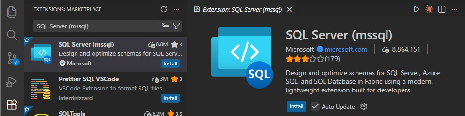
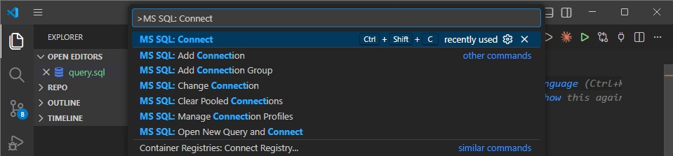
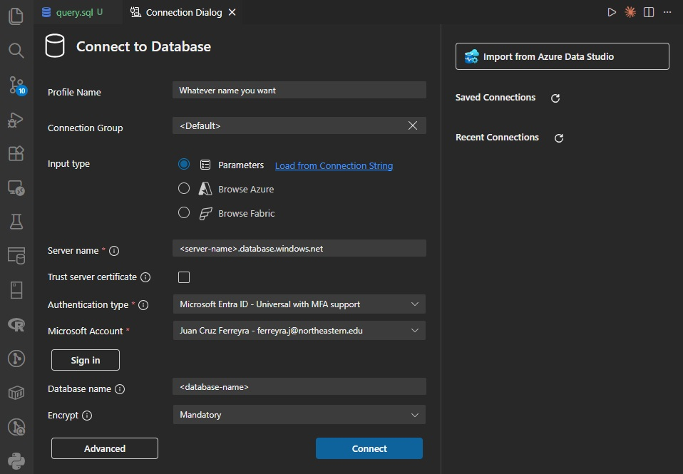
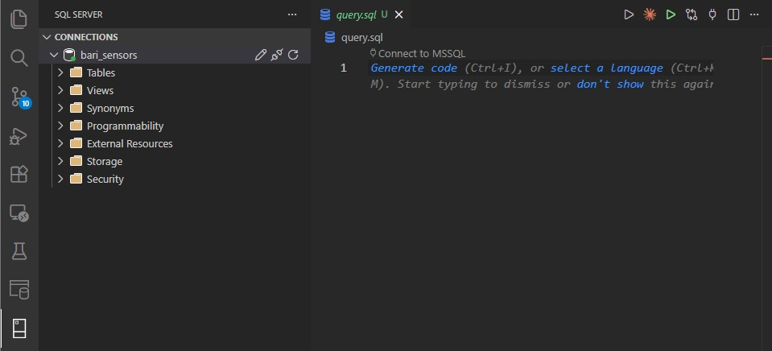
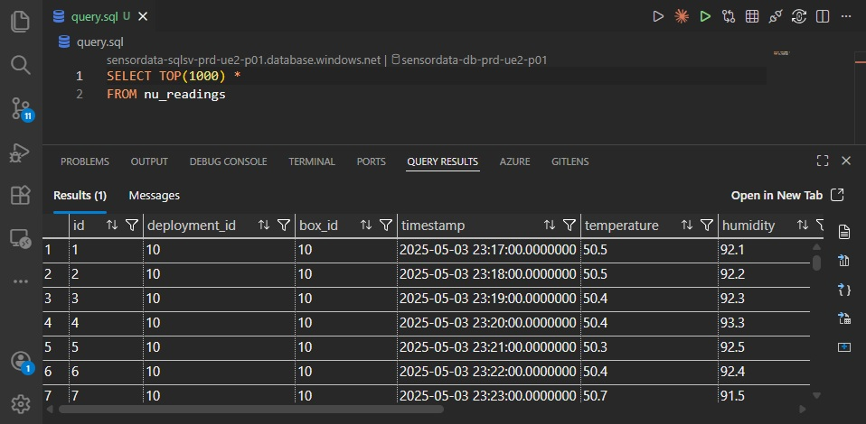
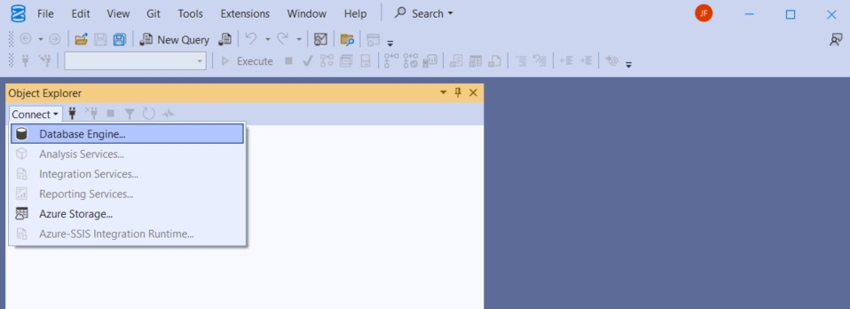
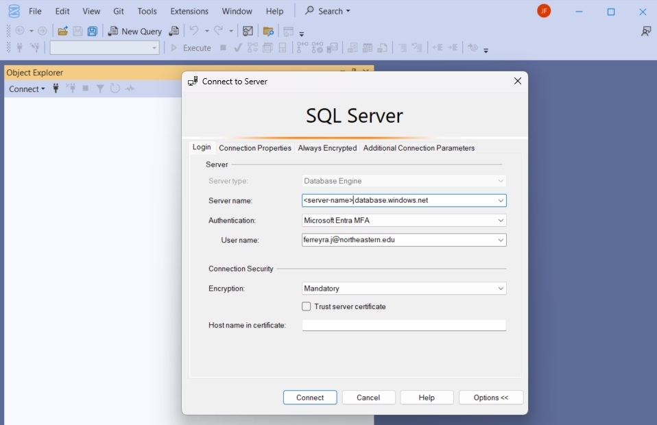
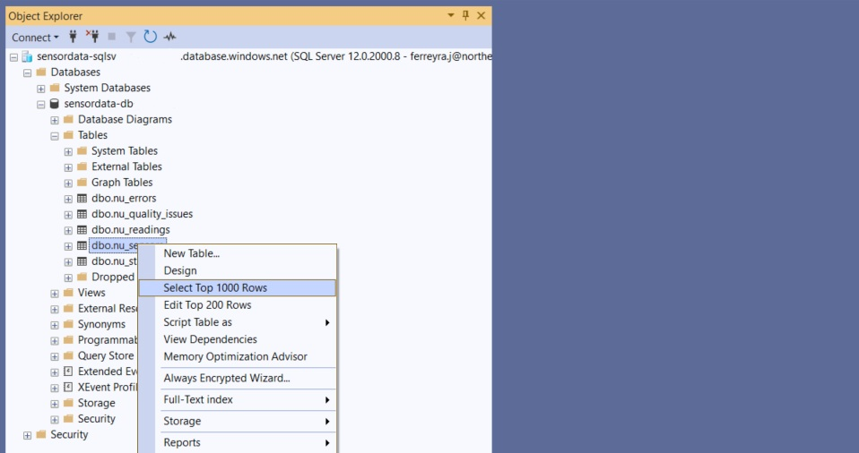
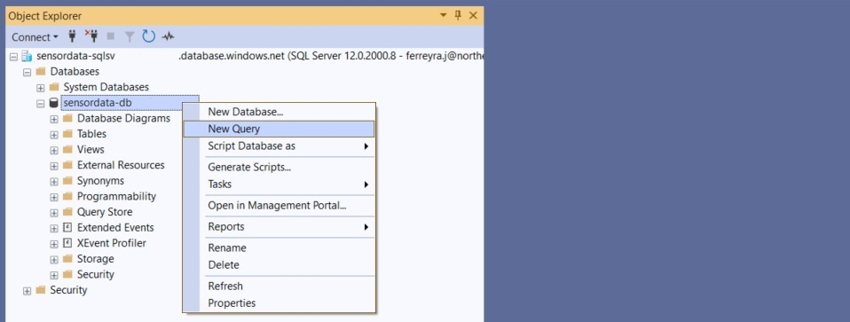
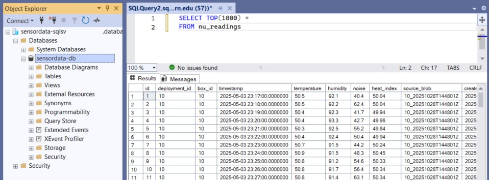

# Connecting to the Database

This page covers how to establish connections to the Azure SQL Database for querying sensor data.

## Prerequisites

**1. Azure Account Access**

You need an Azure account with appropriate permissions to access the database resource.

**2. Authentication Method**

One of the following:

- **Microsoft Entra ID (formerly Azure AD)** - Uses your Azure organizational account (recommended for most users)
- **Managed Identity** - Automatic authentication for Azure resources (used by Function Apps)
- **SQL Authentication** - Traditional username/password (legacy, less secure)

See [Authentication Methods](#authentication-methods) below for detailed explanations.

**3. Network Access**

The database uses private networking by default. You need either:

- Access from within the Azure VNet (automatic for Azure resources)
- Temporary public access enabled from the Azure Portal (see [Network Access](#network-access) below)

For more details on the networking architecture, see [Networking Reference](../../05-reference/azure-infrastructure/networking.md).

!!! info "Need Help?"
    If you're unable to meet any of these prerequisites (Azure access, authentication setup, or network configuration), contact {{ contacts.technical_administrator.name }} ({{ contacts.technical_administrator.role }}).

---

## Connection Methods

Choose a connection method based on your workflow and technical comfort level.

### Azure Portal Query Editor

**What it is:** Browser-based SQL query interface built into the Azure Portal.

**Best for:** Quick queries, one-off checks when already in the portal.

**Who can use this:** Technical administrators with Azure Portal access only. Researchers should use [Visual Studio Code](#visual-studio-code-with-sql-extension-recommended) or [Python](#python-pyodbc) instead.

**Limitations:** Cannot save queries, basic interface, requires portal access.

??? note "Step-by-Step: Connecting via Query Editor"
    1. Navigate to your SQL Database in the Azure Portal
    2. Select "Query editor (preview)" from the left sidebar
    3. Authenticate with your Azure credentials
    4. Start writing SQL queries in the editor
    5. Click "Run" to execute

    Note: Query editor requires portal access and may require public network access to be enabled.

<div style="margin-top: 2rem;"></div>

### Visual Studio Code with SQL Extension (Recommended)

**What it is:** Microsoft's modern code editor with SQL Server extension. Replaces the retired Azure Data Studio.

**Best for:** Regular data analysis, query development, exploring database structure.

**Who can use this:** Anyone with database credentials or Entra ID authentication. Recommended for researchers needing regular data access.

**Download:** [Visual Studio Code](https://code.visualstudio.com/)

**Limitation:** Impractical for complex database administrations.

??? note "Step-by-Step: Installing and Connecting with VS Code"

    **Installation**
    
    **1. Install Visual Studio Code**
    
    Download and install from [code.visualstudio.com](https://code.visualstudio.com/). Multiple installation options available for Windows, Mac, and Linux.
    
    **2. Install SQL Server Extension**
    
    1. Open VS Code
    2. Click Extensions icon in left sidebar (or press Ctrl+Shift+X / Cmd+Shift+X)
    3. Search for "SQL Server (mssql)"
    4. Click Install on the extension by Microsoft
    
    
    
    ---
    
    **Creating a Connection**
    
    **1. Create a SQL File**
    
    Create a new file with `.sql` extension (e.g., `queries.sql`) and open it in VS Code.
    
    **2. Open Connection Dialog**
    
    Press F1 to open Command Palette, then type and select `MS SQL: Connect`
    
    
    
    **3. Configure Connection Profile**
    
    You'll be prompted for connection details:

    
    
    Profile Name: Choose any descriptive name (e.g., "bari_sensors")
    
    Connection Group: Optional - leave blank or organize by project
    
    Input Type: Select "Parameters" (allows manual entry of server details)
    
    - Note: "Browse Azure" option requires Azure Portal access
    
    Server Name: Format: `<server-name>.database.windows.net`
    
    - Find this in Azure Portal → SQL Server resource page
    - Contact {{ contacts.technical_administrator.name }} if you lack portal access
    - Example: `bari-sensor-sqlsv.database.windows.net`
    
    Authentication Type: Select "Microsoft Entra ID" (recommended)
    
    - Alternative: "SQL Login" requires username/password (not recommended - see [Authentication Methods](#authentication-methods))
    - After selecting Entra ID, click "Sign In" button
    - You'll be redirected to browser to sign in with Northeastern credentials
    - Authentication succeeds only if your account has database permissions (reader or writer)
    
    Database Name: Enter the database resource name
    
    - Find this in Azure Portal → SQL Database resource page (resource name)
    - Contact {{ contacts.technical_administrator.name }} if you lack portal access
    - Example: `bari-sensor-db`
    
    Encryption Settings:
    
    - Trust Server Certificate: Keep default
    - Encrypt: Keep default (Yes)
    
    **4. Connect**
    
    Click "Connect" button. If successful, you'll see the connection appear in the SQL Server panel on the left sidebar.
    
    
    
    ---
    
    **Running Queries**
    
    **Creating New Query Files**
    
    - Press F1 → type and select `MS SQL: New Query`
    - Or create any `.sql` file and open it
    
    **Executing Queries**
    
    1. Write your SQL query in the file:

    ```sql
        SELECT TOP(1000) *
        FROM nu_sensors
    ```

    2. Execute the query:
        - Press Ctrl+Shift+E (Cmd+Shift+E on Mac)
        - Or right-click in the editor and select "Execute Query"
    
    3. Results appear in a new panel at the bottom
    
    
    
    **Exporting Results**
    
    Right-click on results table → "Save as CSV" or "Save as JSON"
    
    ---
    
    See [Connection Details](#connection-details) for more information on finding server and database names.

### SQL Server Management Studio (SSMS)

**What it is:** Full-featured Windows database management tool.

**Best for:** Database administration, schema modifications, monitoring. Primary tool for technical administrators.

**Who can use this:** Anyone with database access, but particularly useful for technical administrators performing maintenance tasks beyond simple queries.

**Download:** [SSMS Download](https://docs.microsoft.com/en-us/sql/ssms/download-sql-server-management-studio-ssms)

**Limitation:** Windows only (not available for Mac/Linux).

??? note "Step-by-Step: Installing and Connecting with SSMS"

    **Installation**
    
    Download and install SSMS from the link above. Installation is straightforward - follow the installer prompts.
    
    ---
    
    **Connecting to the Server**
    
    **1. Open Object Explorer**
    
    When you launch SSMS, Object Explorer typically appears on the left side. If not visible:
    - Press F8, or
    - Go to View → Object Explorer
    
    **2. Connect to Database Engine**
    
    In Object Explorer, click "Connect" → "Database Engine"
    
    Or use File → Connect Object Explorer
    
    
    
    **3. Configure Connection**
    
    In the connection dialog:

    
    
    Server type: Database Engine
    
    Server name: `<server-name>.database.windows.net`
    
    - Contact {{ contacts.technical_administrator.name }} if you don't have this
    - Typically the SQL Server resource name + `.database.windows.net`
    - Example: `bari-sql-server.database.windows.net`
    
    Authentication: Select "Microsoft Entra MFA"
    
    - Alternative: "SQL Server Authentication" requires username/password (not recommended - see [Authentication Methods](#authentication-methods))
    
    User name: Your Northeastern account email (e.g., `yourname@northeastern.edu`)
    
    Connection Security:
    - Keep "Encrypt connection" checked
    - Keep "Trust server certificate" unchecked
    
    **4. Sign In**
    
    Click "Connect". You'll be redirected to a browser to sign in with your Northeastern credentials.
    
    After successful authentication, the server connection appears in Object Explorer.
    
    Note: You're connecting to the entire SQL Server, not a specific database. The server contains multiple databases.
    
    ---
    
    **Exploring the Database**
    
    **1. Locate Your Database**
    
    In Object Explorer:
    1. Expand the server connection
    2. Expand "Databases" folder
    3. Find your database (matches the database resource name in Azure Portal)
       
    **2. View Tables and Schema**
    
    Expand: Database → Tables
    
    Here you can see all tables (nu_sensors, nu_readings, etc.) with their columns and data types.

    
       
    Quick Preview: Right-click any table → "Select Top 1000 Rows" to view sample data.
    
    ---
    
    **Running Queries**
    
    **1. Open New Query Window**
    
    Right-click your database name → "New Query"
    
    Important: Don't use the "New Query" button in the top toolbar - it may not connect to your specific database and queries will fail.
    
    
    
    **2. Write and Execute Query**
    
    Write your SQL query:

    ```sql
        SELECT TOP(1000) *
        FROM nu_sensors
    ```

    Execute:
    - Press F5, or
    - Click "Execute" button in toolbar
    
    Results appear in the bottom panel.
    
    
    
    ---
    
    See [Connection Details](#connection-details) for more information on finding server and database names.
!!! note "Project Lead Recommendation"
    {{ contacts.project_lead.name }} found SSMS extremely useful for manual database interaction on Windows. The visual interface and advanced features make complex tasks much easier than other tools.

### Python (pyodbc)

**What it is:** Programmatic database access using Python. This is what the Function Apps use for database operations.

**Best for:** Automated queries, data pipelines, analysis scripts, reproducible workflows.

**Who can use this:** Anyone comfortable with Python programming. Requires basic SQL knowledge.

**Installation:** `pip install pyodbc`

**Example connection code:**

```python
import pyodbc

# Connection string
conn_str = (
    "Driver={ODBC Driver 18 for SQL Server};"
    "Server=tcp:your-server.database.windows.net,1433;"
    "Database=your-database;"
    "Authentication=ActiveDirectoryInteractive;"  # Opens browser for Azure login
    "Encrypt=yes;"
    "TrustServerCertificate=no;"
)

# Connect and query
conn = pyodbc.connect(conn_str)
cursor = conn.cursor()
cursor.execute("SELECT COUNT(*) FROM nu_readings")
result = cursor.fetchone()
print(f"Total readings: {result[0]}")
```

!!! warning "Authentication Best Practices"
    Use `ActiveDirectoryInteractive` (shown above) for personal scripts - opens browser for Northeastern login.

    **Never hardcode SQL usernames/passwords** - anyone with the connection string has full database access.
    
    For Azure resources (Function Apps), use Managed Identity instead - see [Function Apps Reference](../../05-reference/azure-infrastructure/function-apps.md#authentication).

??? note "Step-by-Step: Python Database Connection"

    **1. Install ODBC Driver**
    
    Python requires the ODBC Driver for SQL Server. Download from [Microsoft's ODBC Driver page](https://docs.microsoft.com/en-us/sql/connect/odbc/download-odbc-driver-for-sql-server).
    
    **2. Install pyodbc**

    ```bash
        pip install pyodbc
    ```
    
    **3. Get Connection Details**
    
    - Server name: Contact {{ contacts.technical_administrator.name }} or find in Azure Portal
    - Database name: Same as database resource name
    
    **4. Create Connection Script**
    
    Replace `your-server` and `your-database` with actual values in the example code above.
    
    **5. Run Script**
    
    When you run the script, a browser window opens for Northeastern authentication. After successful login, the script executes.
    
    **6. Handle Connection Errors**
    
    Common issues:

    - "ODBC Driver not found" → Install ODBC Driver (step 1)
    - "Login failed" → Check authentication method and credentials
    - "Cannot open server" → Enable public network access (see [Network Access](#network-access))

### R and Other Languages

SQL Server supports standard connection protocols (ODBC, JDBC) that work with most programming languages:

- **R:** Use `odbc` or `RODBC` packages
- **JavaScript/Node.js:** Use `mssql` package
- **Java:** Use JDBC driver

Refer to Microsoft's [SQL Database connection libraries](https://docs.microsoft.com/en-us/azure/azure-sql/database/connect-query-content-reference-guide) for language-specific documentation.

---

## Authentication Methods

The database supports three authentication methods. Choose based on your use case and security requirements.

### Microsoft Entra ID (Recommended for Individual Users)

Uses your Northeastern Azure credentials to authenticate. {{ contacts.technical_administrator.name }} configures access for specific Northeastern accounts, granting either read or write permissions. If your account has been added with appropriate permissions, you can connect to the database using this method.

**Benefits:**

- No passwords to manage
- Permissions tied to your organizational account
- Access automatically revoked when leaving organization
- Audit trail of database access

**How to connect:**

- **Python:** Use `Authentication=ActiveDirectoryInteractive` - see [Python example](#python-pyodbc)
- **Visual Studio Code:** Follow [VS Code connection steps](#visual-studio-code-with-sql-extension-recommended)
- **SSMS:** Follow [SSMS connection steps](#sql-server-management-studio-ssms)

### SQL Authentication (Not Recommended)

Traditional username/password authentication.

**Why avoid:**

- Credentials must be stored in code or configuration files (security risk)
- Anyone with credentials has full database access
- Requires manual credential rotation
- No audit trail of individual users

**When acceptable:** Temporary testing only, never in production systems.

Contact {{ contacts.technical_administrator.name }} if you believe you need SQL authentication credentials.

### Managed Identity (For Azure Resources Only)

Azure resources within the same subscription (Function Apps, VMs) can authenticate automatically without storing credentials.

**How it works:** If private networking is configured correctly and the resource's managed identity has been granted database permissions (read, write, etc.), the resource can access the database even when public access is disabled.

**Benefits:**

- Zero credentials to manage
- Permissions set per-resource (least privilege principle)
- Cannot be compromised by leaked code
- Works with private endpoints (public access disabled)

**Configuration:** See [Function Apps - Authentication](../../05-reference/azure-infrastructure/function-apps.md#authentication) for setup details.

!!! warning "Network Access Required"
    Both Microsoft Entra ID and SQL Authentication require network connectivity to the database. If public network access is disabled (default), connections from outside Azure will fail regardless of authentication method.

    See [Network Access](#network-access) below and [Networking Reference](../../05-reference/azure-infrastructure/networking.md) for details on enabling temporary public access.
    
    **Exception:** Managed Identity works through private endpoints and does not require public access.

Okay finally the last aprt in this page:

---

## Network Access

The database uses private networking by default, restricting connections to Azure resources within the same Virtual Network (VNet).

### Private Endpoint (Default)

**What it means:** The database is only accessible from within Azure's internal network.

**Who can connect:**

- Azure Function Apps (automatically - they're in the VNet)
- Other Azure resources configured in the same VNet

**Who cannot connect:**

- Your laptop/desktop computer
- External tools running outside Azure
- Scripts running on your local machine

For complete networking architecture details, see [Networking Reference](../../05-reference/azure-infrastructure/networking.md).

### Temporary Public Access

To connect from your computer, you need to temporarily enable public network access.

**Security implications:**

- Opens database to internet connections (with firewall restrictions)
- Should only be enabled when actively working with data
- Must be disabled immediately after use

### Enabling Temporary Public Access

??? note "Step-by-Step: Enable Public Access for SQL Database"
    1. Navigate to Azure Portal → SQL Server (not SQL Database)
    2. Select "Networking" in the "Security" section from left sidebar
    3. Under "Public network access" → Select "Selected networks"
    4. Under "Firewall rules" → Click "Add your client IPv4 address"
    5. Click "Save"

    **To disable:** Return to same page, select "Disable" under "Public network access", click "Save"

For detailed instructions with screenshots, see [Appendix: Network Configuration](../../06-appendices/step-by-step-guides/configure-network-access.md).

!!! warning "Remember to Disable"
    Always disable public access when finished. Leaving it enabled creates unnecessary security exposure.
