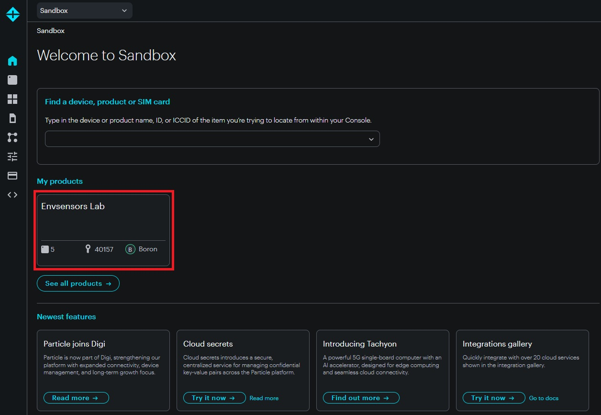
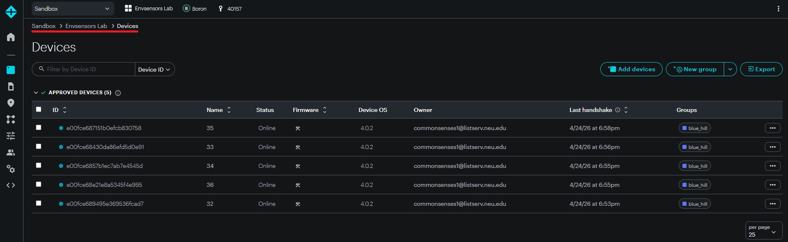
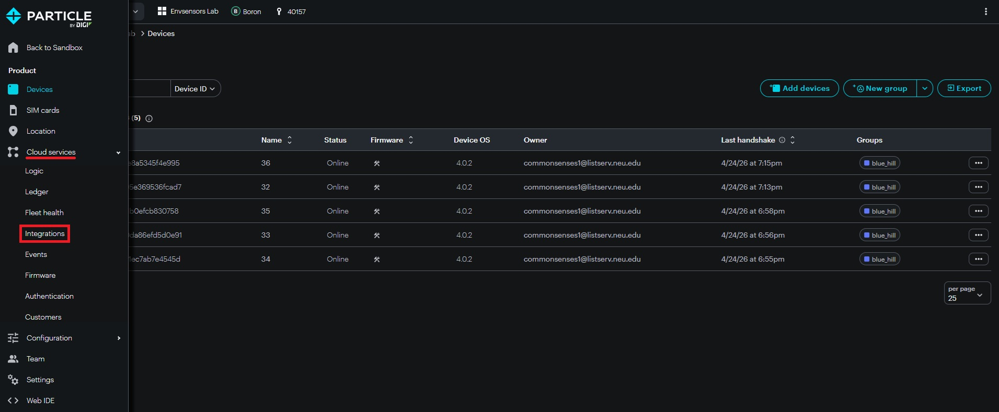
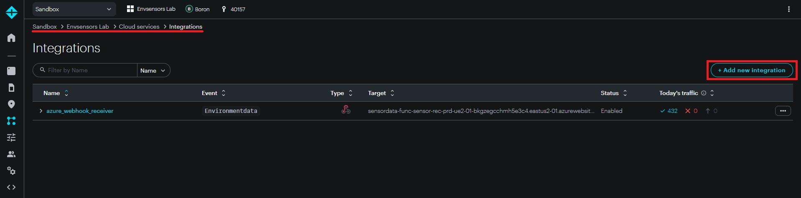
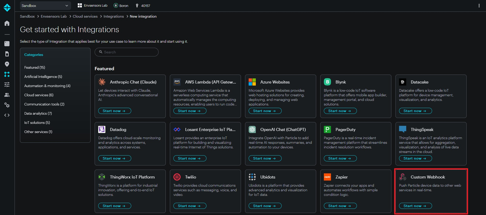

# Sensor Configuration

This page explains how Particle sensor configuration relates to the Azure data pipeline. The physical sensors and Particle accounts are managed by the hardware team. The main responsibility for this project is making sure Particle webhook integrations send sensor messages to the correct Azure Webhook Receiver endpoint.

For Particle message formats, see [Particle Platform Reference](../05-reference/particle-platform.md). For the Azure ingestion function, see [Function Code Reference](../05-reference/function-code-reference.md).

## Ownership and Responsibilities

Sensor hardware setup is handled by Amy's team. This includes:

* Preparing the physical sensor boxes
* Managing SIM cards and cellular connectivity
* Adding devices to Particle accounts
* Managing firmware and sensor-side code
* Providing Particle account credentials when needed

If you need access to Particle accounts or have questions about hardware, firmware, or cellular setup, contact {{ contacts.hardware_team.name }}.

This project is responsible for:

* Configuring Particle webhook integrations
* Pointing webhooks to the correct Azure Webhook Receiver endpoint
* Verifying that Particle messages reach Azure
* Troubleshooting whether data loss is happening before or after Azure receives the webhook

---

## Account Structure

The sensors are distributed across several Particle accounts. This was done to keep each account within Particle free-tier limits.

Because sensors are spread across multiple accounts, webhook maintenance must be repeated in each relevant account. This is especially important when changing the Azure webhook URL.

Changing or rotating the webhook URL is possible, but it is not operationally convenient because the URL must be updated manually across all Particle accounts and project-level integrations.

Webhook URL rotation is recommended only when there is a specific reason, such as:

* The webhook URL or function key may have been exposed publicly
* Unexpected external data appears to be reaching the Azure endpoint
* The Azure Webhook Receiver Function was recreated and received a new endpoint URL
* The webhook authentication method or function key changed

## Accessing Particle Console

Particle configuration is managed through the Particle Console:

```text
https://console.particle.io
```

Log in using the Particle account credentials provided by Amy's team. Because the sensors are distributed across multiple Particle accounts, make sure you are logged into the account that contains the sensor or project you need to inspect.

After logging in, use the Particle Console to access:

* **Devices**: check whether a sensor is online and publishing
* **Integrations**: configure or inspect webhook integrations
* **Events**: view raw messages published by sensors
* **Projects/Products**: access the project-level device group used for this deployment

For this project, webhook configuration should be done at the project level ('Envsensors Lab'), not at the general account level.

---

## Adding a New Sensor to Particle Platform

New sensors are added to Particle by the hardware team, not through this documentation workflow.

Before a new sensor can send data to Azure, confirm with Amy's team that:

* The physical sensor box is assembled and functional
* The SIM card and cellular connection are working
* The device has been added to the correct Particle account
* The device is assigned to the correct Particle project or product
* The sensor publishes messages in the expected format

After the device exists in Particle, configure or verify the webhook integration so messages are forwarded to Azure.

---

## Webhook Integration Scope

Particle webhooks can be configured at different levels in the Particle Console.

In this project, webhooks should be configured at the project level for consistency.

Two common places where devices may appear are:

| Particle Area                        | Meaning                           | Use in This Project                                                               |
| ------------------------------------ | --------------------------------- | --------------------------------------------------------------------------------- |
| `Sandbox > Devices`                  | Account-level device area         | Avoid configuring webhooks here unless intentionally using account-level behavior |
| `Sandbox > Envsensors Lav > Devices` | Project/product-level device area | Preferred location for this project                                               |

Both account-level and project-level integrations can work. However, configuring the same webhook at both levels can cause each sensor message to be sent twice.

!!! warning "Avoid Duplicate Webhooks"
Do not configure equivalent webhook integrations at both the account level and project level. If both are active for the same event stream, Azure will receive duplicate messages from each sensor.

The Azure Webhook Receiver includes duplicate detection, but duplicate Particle webhook integrations should still be fixed at the Particle configuration level.

---

## Finding the Azure Webhook Receiver URL

The webhook URL points to the Azure Webhook Receiver Function.

To find the endpoint URL:

1. Open the Azure Portal.
2. Navigate to the Webhook Receiver Function App resource: `sensordata-func-sensor-rec-...`.
3. Open the function or function overview page.
4. Locate the HTTP trigger endpoint URL.
5. Copy the full function URL, including any required function key.

The URL should point to the webhook route exposed by the Function App.

```text
https://<function-app-name>.azurewebsites.net/api/webhook?<function-key-if-required>
```


!!! warning "Treat Function URLs Carefully"
The webhook URL may include a function key. Treat it as a secret. Do not commit it to public repositories, paste it in public documents, or share it outside the project team.

---

## Configuring the Particle Webhook

Configure the webhook in the Particle project associated with the sensor devices.

Recommended location:

```text
Sandbox > Envsensors Lab > Devices
```

````md
??? note "Step-by-Step: Configuring a Particle Webhook Integration"

    **Before You Start**

    Particle webhooks should be configured at the project level, not at the general account level. For this project, that means entering the **Envsensors Lab** project before creating or modifying integrations.

    You will need:

    - Access to the correct Particle account credentials from Amy's team
    - The Azure Webhook Receiver Function default domain
    - The Azure Webhook Receiver Function default app key

    ---

    **Opening the Particle Project**

    **1. Go to Particle Console**

    Open the Particle Console in your browser:

    ```text
    https://console.particle.io
    ```

    Log in using the Particle account credentials provided by Amy's team.

    **2. Enter the Envsensors Lab Project**

    From the Particle Console home page, click **Envsensors Lab**.

    

    This step is important. If you create the integration from the general account area, the webhook may be configured at the account level instead of the project level.

    **3. Confirm You Are Inside the Project**

    After entering the project, confirm that the navigation path shows:

    ```text
    Sandbox > Envsensors Lab > Devices
    ```

    

    The important part is **Envsensors Lab**. If the page only shows:

    ```text
    Sandbox > Devices
    ```

    then you are still at the account level and should not create the webhook there.

    ---

    **Opening Integrations**

    **1. Open the Left Menu**

    Hover over the left sidebar to expand the Particle project menu.

    Under **Cloud Services**, select **Integrations**.

    

    **2. Start a New Integration**

    On the Integrations page, confirm again that the navigation path includes **Envsensors Lab**.

    Then click the button to create a new integration.

    

    **3. Select Custom Webhook**

    From the integration type menu, select **Custom Webhook**.

    

    ---

    **Defining the Webhook**

    **1. Fill in the Webhook Definition**

    On the webhook definition page, complete the main fields.

    

    **Name:** Use a clear name. Check the other Particle accounts first and follow the existing naming convention for consistency.

    **Event name:**

    ```text
    Environmentdata
    ```

    **URL:**

    ```text
    https://<AZURE-FUNCTION-DEFAULT-DOMAIN>/api/webhook?code=<AZURE-FUNCTION-DEFAULT-KEY>
    ```

    Example structure:

    ```text
    https://sensordata-func-sensor-rec-xyz.azurewebsites.net/api/webhook?code=abc123
    ```

    ---

    **Finding the Azure Function URL Parts**

    The webhook URL has two Azure-specific parts:

    ```text
    https://<AZURE-FUNCTION-DEFAULT-DOMAIN>/api/webhook?code=<AZURE-FUNCTION-DEFAULT-KEY>
    ```

    **1. Find the Azure Function default domain**

    In the Azure Portal:

    1. Open the Webhook Receiver Function App resource: `sensordata-func-sensor-rec-...`
    2. Go to **Overview** in the left sidebar
    3. Copy the **Default domain**

    The default domain already includes the `.azurewebsites.net` suffix.

    Example:

    ```text
    sensordata-func-sensor-rec-xyz.azurewebsites.net
    ```

    **2. Find the Azure Function default key**

    In the same Azure Function App resource:

    1. Go to **Functions** in the left sidebar
    2. Open **App keys**
    3. Copy the key named **default**

    Do **not** use the `_master` key.

    !!! warning "Do Not Use the Master Key"
        Use the `default` app key for the Particle webhook URL. The `_master` key has elevated permissions and should not be used for normal webhook integrations.

    ---

    **Saving and Testing**

    **1. Save the Integration**

    Save the webhook integration after filling in the required fields.

    **2. Test the Integration**

    Use the Particle integration test option if available. Then verify the Azure side:

    1. Check that Particle shows the webhook delivery as successful.
    2. Check Azure Function logs for a received webhook request.
    3. Check Blob Storage for a new blob under:

        ```text
        environment/incoming/
        ```

    If the message is malformed or has an unexpected format, it may appear under `malformed/` or `unknown/` instead.

    ---

    **Important Checks**

    Before finishing, confirm:

    - The integration was created inside **Sandbox > Envsensors Lab**, not only **Sandbox**
    - There is not another equivalent webhook at the account level
    - The event name matches the firmware event name exactly
    - The URL points to the current Azure Webhook Receiver Function
    - The URL uses the `default` app key, not the `_master` key
    - A test or real sensor message reaches Blob Storage
````

After saving the webhook, use the Particle Console to confirm that events are being forwarded.

---

## Testing the Webhook Integration

After configuring or modifying a webhook, verify the full path from Particle to Azure.

Recommended checks:

1. Confirm the sensor publishes a message in Particle Events.
2. Confirm the Particle webhook integration shows successful deliveries.
3. Confirm a new blob appears in the expected Blob Storage folder.
4. Confirm the Database Writer later moves the blob out of `incoming/`.
5. Confirm records appear in the SQL Database.

For environmental data, the expected first Azure destination is:

```text
environment/incoming/
```

For error and startup messages, the expected destinations are:

```text
error/incoming/
startup/incoming/
```

Malformed messages may be routed to `malformed/`, and unknown messages may be routed to `unknown/`.


---

## Modifying Webhook Settings

Webhook settings should be modified only when needed.

Common reasons include:

* The Azure Webhook Receiver URL changed
* The Function App was recreated
* The function key was rotated
* Duplicate integrations were discovered
* The webhook was configured at the wrong scope
* Particle delivery logs show repeated failures

Before modifying a webhook:

* Confirm which Particle account contains the affected sensors.
* Confirm whether the webhook is account-level or project-level.
* Confirm whether an equivalent webhook already exists elsewhere.
* Copy the current configuration before changing it.
* Notify the team if the change may temporarily interrupt data ingestion.

After modifying a webhook, run the verification steps in [Testing the Webhook Integration](#testing-the-webhook-integration).

---

## Moving Sensors Between Accounts

Sensors may need to move between Particle accounts if account limits change or if the hardware team reorganizes device ownership.

This is handled by Amy's team. Coordinate with them before assuming a sensor has moved or disappeared.

If a sensor is moved to another Particle account, verify that:

* The sensor still appears in Particle Console.
* The sensor is assigned to the correct project/product.
* A project-level webhook exists in the destination account.
* The webhook points to the correct Azure Webhook Receiver URL.
* The sensor's `coreid` still matches the metadata expected by the Azure pipeline.
* New messages are reaching Blob Storage.

---

## Troubleshooting

### Sensor Not Appearing in Particle Console

Likely source: hardware, account access, device ownership, or cellular setup.

Actions:

* Confirm you are logged into the correct Particle account.
* Confirm with Amy's team that the device was added to that account.
* Check whether the device belongs to a project/product rather than the account-level device list.
* Ask the hardware team to verify power, SIM card, cellular connectivity, and firmware status.

### Sensor Appears but Is Not Publishing Events

Likely source: sensor-side issue.

Actions:

* Check Particle Events for recent messages.
* Look for startup messages or error messages.
* Check the last connection time in Particle Console.
* Contact Amy's team if the device is offline or repeatedly restarting.

### Webhook Not Triggering

Likely source: integration configuration.

Actions:

* Confirm the webhook is enabled.
* Confirm the event name matches the sensor firmware event name.
* Confirm the webhook is configured in the correct Particle account and project.
* Confirm the webhook URL points to the current Azure Webhook Receiver endpoint.
* Confirm the function key is still valid, if one is used.
* Check whether the webhook was accidentally configured at both account and project levels.

### Particle Shows Events but Azure Receives Nothing

Likely source: webhook delivery or Azure Webhook Receiver access.

Actions:

* Check Particle integration delivery status.
* Confirm the Azure Function App is running.
* Confirm the Webhook Receiver endpoint is publicly reachable.
* Check Azure Function logs for incoming requests or errors.
* Verify the function URL and function key.

### Azure Receives Duplicate Messages

Likely source: duplicate Particle webhook integrations.

Actions:

* Check both account-level and project-level integrations.
* Disable duplicate integrations that point to the same Azure endpoint.
* Keep the project-level integration as the standard configuration.
* Verify that future messages are no longer duplicated.

### Blobs Arrive but Data Does Not Reach SQL

Likely source: Azure-side processing, not Particle.

Actions:

* Check Blob Storage `incoming/`, `failed-processing/`, and `failed-writing/` folders.
* Check Database Writer logs.
* Check SQL Database availability.
* See [Blob Storage Reference](../05-reference/azure-infrastructure/blob-storage.md) and [Function Code Reference](../05-reference/function-code-reference.md).

---

## Related Documentation

* [Particle Platform Reference](../05-reference/particle-platform.md)
* [Function Code Reference](../05-reference/function-code-reference.md)
* [Blob Storage Reference](../05-reference/azure-infrastructure/blob-storage.md)
* [Data Flow](../01-understanding-the-system/data-flow.md)
* [Troubleshooting: Sensor Not Reporting](../03-operating-the-system/troubleshooting/sensor-not-reporting.md)
