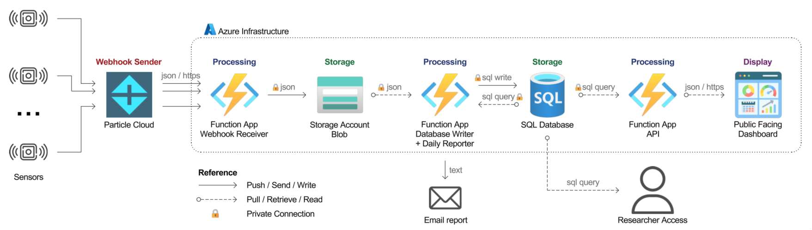

# Networking

## Overview



The Azure infrastructure uses private networking for security, meaning resources are isolated from the public internet by default.

**Key points:**
- Resources communicate through a private Virtual Network (VNet)
- External connections (from your computer) require temporarily enabling public access
- Protects sensitive sensor data from unauthorized access

**Who can connect automatically:**
- Azure Function Apps (VNet integrated)
- Azure Portal tools (internal routing)
- Other Azure resources in the same VNet

**Who cannot connect by default:**
- Personal computers outside Azure
- External tools and scripts

To connect from your computer, see [Enabling Public Access](#enabling-public-access) below.

---

## Network Architecture

### Components

**Virtual Network (VNet)**

Isolated network within Azure containing all project resources. Resources communicate using private IP addresses, never exposing traffic to the public internet.

- **VNet Name:** `{{ azure.vnet_name }}`
- **Address Space:** Private IP range for all resources
- **Subnets:** Separate network segments for different resource types

**Private Endpoints**

Secure connections that bring Azure PaaS services (SQL Database, Storage Account) into the VNet. Traffic between resources stays within Microsoft's network backbone.

- **SQL Database Private Endpoint:** Allows Function Apps to query database without public access
- **Storage Account Private Endpoint:** Allows Function Apps to read/write blobs securely
- **Benefit:** Even if public access is disabled, internal resources can still communicate

**VNet Integration**

Function Apps are integrated with the VNet, allowing them to:
- Access SQL Database through private endpoint
- Read/write to Storage Account through private endpoint
- Operate without requiring public network access enabled

**Network Security**

- All inter-resource communication uses private networking
- Public access disabled by default for SQL Database and Storage
- Firewall rules control which external IP addresses can connect when public access is temporarily enabled
- No inbound traffic from internet unless explicitly allowed

**Data Flow Example:**
```
Particle Sensor (external)
    ↓ [HTTPS webhook - public internet]
Webhook Function (public endpoint)
    ↓ [private network]
Blob Storage (private endpoint)
    ↓ [private network]
Database Writer Function (VNet integrated)
    ↓ [private network]
SQL Database (private endpoint)
```

Only the Webhook Function has a public endpoint (required to receive Particle data). All other communication is private.

---

## Enabling Public Access

Multiple resources use private networking. When you need to connect from your computer, temporarily enable public access for the specific resource.

### SQL Database

To query data or perform database administration from your computer:

??? note "Enable Public Access for SQL Database"
    
    **Navigate to SQL Server resource** (not SQL Database)
    1. Azure Portal → SQL servers → `<your-sql-server-name>`
    2. Select "Networking" from left sidebar
    
    **Enable Public Access**
    3. Under "Public network access" → Select "Selected networks"
    4. Under "Firewall rules" → Click "Add your client IP address"
    5. Click "Save"
    
    Your computer can now connect to the database.
    
    **Disable When Finished**
    1. Return to same Networking page
    2. Under "Public network access" → Select "Disabled"
    3. Click "Save"
    
    [Screenshot placeholders]

See also: [Connecting to Database - Network Access](../02-working-with-data/database/connecting.md#network-access)

---

### Storage Account

To access blob storage (download raw JSON files, upload test data) from your computer:

??? note "Enable Public Access for Storage Account"
    
    **Navigate to Storage Account resource**
    1. Azure Portal → Storage accounts → `<your-storage-account-name>`
    2. Select "Networking" from left sidebar
    
    **Enable Public Access**
    3. Under "Public network access" → Select "Enabled from selected virtual networks and IP addresses"
    4. Under "Firewall" → Click "Add your client IP address"
    5. Click "Save"
    
    Your computer can now access blob storage.
    
    **Disable When Finished**
    1. Return to same Networking page
    2. Under "Public network access" → Select "Disabled"
    3. Click "Save"
    
    [Screenshot placeholders]

See also: [Accessing Blob Storage](../02-working-with-data/blob-storage/accessing-blobs.md#network-access)

---

### Function Apps (for Deployment)

To deploy function code from your local development environment:

??? note "Enable Public Access for Function App Deployment"
    
    **Navigate to Function App resource**
    1. Azure Portal → Function App → `<your-function-app-name>`
    2. Select "Networking" from left sidebar
    
    **Enable Public Access**
    3. Under "Inbound Traffic" → Click "Access restriction"
    4. Under "Main site" → Click "Add rule"
    5. Add your IP address or select "Allow all"
    6. Click "Save"
    
    You can now deploy code using Azure CLI, VS Code, or other deployment tools.
    
    **Disable When Finished**
    1. Return to Access restrictions
    2. Remove the rule you added
    3. Click "Save"
    
    [Screenshot placeholders]

See also: [Deploying Function Updates](../04-making-changes/deploying-code-updates.md#network-requirements)

---

!!! warning "Always Disable Public Access"
    Public access creates security exposure. Enable only when needed, disable immediately after use.
    
    Contact {{ contacts.technical_administrator.name }} if you need frequent access - there may be better solutions than repeatedly toggling public access.

---

## Architecture Decisions

### Why Manual Public Access Control?

The current architecture requires manually toggling public access for external connections. This design was chosen after evaluating alternatives with the Northeastern Azure team.

**Initial Proposal: Northeastern Managed Network**

Northeastern's Azure team initially proposed hosting all infrastructure within their centrally managed network, which would have provided:

- Automatic VPN-based access for Northeastern users
- No manual public access toggles needed
- Centralized security and compliance management
- Consistent with other Northeastern Azure projects

**Critical Limitation: External Data Sources**

This approach had a fatal flaw: **resources within Northeastern's managed network cannot receive data from external internet sources** like Particle.io sensors.

The workaround required an Azure Application Gateway to proxy external traffic into the managed network. Cost analysis:

- Application Gateway alone: ~$160/month
- Current system total: ~$80/month
- Northeastern network approach: ~$240/month (3x current cost)

For a research project with limited funding, tripling infrastructure costs was not viable.

**Chosen Architecture: Independent VNet with Private Endpoints**

The project uses a separate VNet outside Northeastern's managed network, with:

**Benefits:**
- Can receive external sensor data from Particle.io
- Cost-efficient (~$80/month total)
- Private endpoints still provide strong security
- Function Apps communicate privately (no public access needed)

**Tradeoffs:**
- Researchers need manual public access for database queries
- No automatic VPN-based access
- Technical administrator must manage access requests

**Alternative Access Methods:**

For researchers without portal access:
1. Request data exports from {{ contacts.technical_administrator.name }}
2. Use the public dashboard for visualization
3. Request temporary portal access for specific projects

This architecture prioritizes **cost efficiency** and **system functionality** (receiving external data) over access convenience, appropriate for a budget-constrained research project.

---

## Troubleshooting

### Cannot Connect from Local Machine

**Symptoms:** Connection timeout or "Cannot open server" errors when trying to connect to SQL Database or Storage Account.

**Cause:** Public network access is disabled (default security setting).

**Solution:**
1. Verify you have the correct server/account name
2. Enable temporary public access following steps above
3. Ensure your IP address is added to firewall rules
4. Check your network isn't blocking outbound connections on port 1433 (SQL) or 443 (Storage)

---

### Firewall Blocking Connection

**Symptoms:** Connection succeeds sometimes but fails from different locations/networks.

**Cause:** Your IP address changed or wasn't added to firewall rules.

**Solution:**
1. Check your current public IP address (google "what is my ip")
2. Verify it matches the IP in Azure firewall rules
3. If using VPN or dynamic IP, you may need to update firewall rules frequently
4. Alternative: Enable "Allow Azure services" (less secure but more convenient for testing)

---

### VNet Integration Issues

**Symptoms:** Function Apps cannot connect to SQL Database or Storage despite private endpoints configured.

**Cause:** VNet integration misconfigured or private endpoint not properly linked.

**Solution:**
1. Verify Function App has VNet integration enabled (Settings → Networking)
2. Check private endpoints exist for SQL and Storage
3. Confirm private DNS zones are configured
4. Review Function App logs for specific connection errors

Contact {{ contacts.technical_administrator.name }} if VNet issues persist - requires Azure administrative access to diagnose.

---